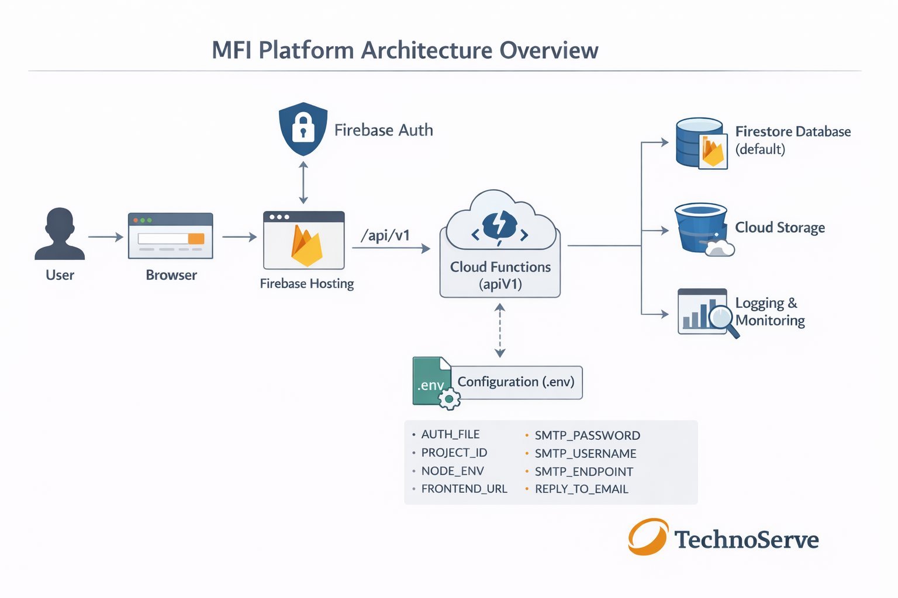

# MFI (Millers for Nutrition)


A Firebase-powered web application built to support millers' self-assessment and nutrition tracking across organizations.

## 📚 Documentation

All technical documentation for the MFI platform is maintained in the `/docs` directory.

➡️ **Start here:** [Documentation Index](docs/README.md)

This includes:
- Tech Training Manual
- Handover Technical Documentation
- Deployment Runbook
- Architecture diagrams and references

## 📦 Project Structure

```
├── frontend         # React-based frontend interface
├── functions        # Firebase Cloud Functions (Node.js backend)
├── .husky           # Git hooks (pre-commit linting)
├── package.json     # Project metadata and scripts
```

## 🚀 Features

- 🔐 Firebase Authentication
- ☁️ Firebase Functions for backend logic
- 🌐 React-based frontend
- ✅ Linting and formatting with ESLint + Prettier
- 🧪 Git hooks using Husky and Pretty-Quick
- 📤 One-step deployment to Firebase
- 🔐 Secure secrets management using Firebase Secrets
- 🗄️ Firestore (Native mode) for structured assessment data

## 🛠️ Scripts

| Script            | Description                             |
|-------------------|-----------------------------------------|
| `npm run serve`   | Serve Firebase locally in production mode |
| `npm run deploy`  | Deploy app to Firebase                  |
| `npm run lint`    | Run lint checks for frontend and functions |
| `npm run format`  | Auto-format code with Prettier          |
| `npm run husky:install` | Set up Git hooks                  |
| `npm run pull:deploy`   | Pull from `develop` and deploy    |

## 📦 Installation

```bash
git clone https://github.com/TechnoServe/MFI-Web.git
cd MFI-main
npm install
```

> **Note:** This project requires **Node.js v20.18.2**.
> If you're using NVM:

```bash
nvm install 20.18.2
nvm use 20.18.2
```

> **Firebase CLI Requirement:**
> This project requires **Firebase CLI v15.4.0**.

### Install Firebase CLI

Using npm (recommended):

```bash
npm install -g firebase-tools@15.4.0
```

Verify installation:

```bash
firebase --version
```

The output should be:

```
15.4.0
```

> ⚠️ Using a different Firebase CLI version may result in deployment or emulator incompatibilities.

### Install frontend and functions dependencies:

```bash
cd frontend && npm install
cd ../functions && npm install
```

## 🔧 Firebase Setup

Make sure you’ve initialized Firebase with the correct project settings:

```bash
firebase login
firebase use --add
```

### 🔐 Secrets Configuration (Required)

This project currently uses a `.env` file located in the `functions/` directory to manage sensitive configuration values during deployment.

> ⚠️ **Important:** This is an intentional, transitional setup. While Firebase Secrets are supported and recommended long-term, the current MFI deployment relies on `.env` values being loaded at deploy/build time.

The following environment variables must be present in `functions/.env` before deploying Cloud Functions:

```env
AUTH_FILE=path_to_service_account_json
PROJECT_ID=ignite-program
NODE_ENV=production
FRONTEND_URL=https://selfassessment.mfi-ng.org
TRANSACTIONAL_EMAIL_ADDRESS=no-reply@mfi-ng.org
SMTP_USERNAME=your_smtp_username
SMTP_PASSWORD=your_smtp_password
SMTP_ENDPOINT=your_smtp_host
REPLY_TO_EMAIL=mfi@tns.org
```

**Variable notes:**
- `AUTH_FILE` — Path to the Google service account JSON used for admin access
- `PROJECT_ID` — Google Cloud / Firebase project ID
- `NODE_ENV` — Deployment environment (`production` or `development`)
- `FRONTEND_URL` — Allowed frontend origin for CORS
- `TRANSACTIONAL_EMAIL_ADDRESS` — Sender address for system emails
- `SMTP_USERNAME` / `SMTP_PASSWORD` — SMTP credentials for email delivery
- `SMTP_ENDPOINT` — SMTP server hostname
- `REPLY_TO_EMAIL` — Reply-to address for outgoing emails

During deployment, these values are loaded into the Cloud Functions environment. Any deployment environment (local machine or CI/CD) **must provide an identical `.env` file** to ensure consistency.

> 🔐 **Security Note:** The `.env` file must never be committed to source control and should be securely shared with authorized personnel only.

To serve locally:

```bash
npm run serve
```

## ✅ Pre-commit Hooks

Linting runs automatically before every commit using Husky:

```bash
npm run lint
```

## 🏗️ Architecture Overview



**Figure:** High-level architecture of the MFI Self-Assessment platform showing Firebase Hosting, Cloud Functions (Gen 1), Firestore (Native), Authentication, Storage, and Secrets integration.

MFI is built on Firebase and Google Cloud Platform using the following components:

- **Frontend:** React (Firebase Hosting)
- **Backend:** Firebase Cloud Functions (Node.js, Gen 1)
- **Authentication:** Firebase Authentication
- **Authorization:** Application-level logic using Firestore data (no custom claims)
- **Database:** Firestore (Native mode)
- **Storage:** Firebase Storage
- **Configuration:** `.env`-based environment variables loaded at deploy time

The system is designed for scalability, security, and maintainability, and supports future multi-country extensions.

## 🔄 Platform Evolution (Old vs Current Setup)

This section highlights the key runtime changes made to the MFI platform over time for clarity during handover and maintenance.

### Old Setup
- **Cloud Functions Runtime:** Node.js 18 (`nodejs18`)
- **Local Development Environment:** Node.js 18
- **Deployment Target:** Firebase Cloud Functions (Gen 1)

### Current Setup
- **Cloud Functions Runtime:** Node.js 20 (`nodejs20`)
- **Local Development Environment:** Node.js **20.18.2**
- **Deployment Target:** Firebase Cloud Functions (Gen 1)

> ℹ️ Note: While the Cloud Functions runtime has been upgraded to Node.js 20, the platform remains on **1st Gen Cloud Functions**. No 2nd Gen migration has been performed.

## 🌐 Live URL

[https://selfassessment.mfi-ng.org](https://selfassessment.mfi-ng.org)

Production (Nigeria – MFI): https://selfassessment.mfi-ng.org

## 🖼️ Architecture Diagram

The architecture diagram is located at:

```
docs/architecture/mfi-architecture.png
```

This diagram should be updated whenever there are significant changes to the hosting, backend services, authentication flow, or database structure.

## 📄 License

ISC License. See [LICENSE](LICENSE) for details.

## 🤝 Contributing

Pull requests are welcome. Please open an issue first to discuss what you’d like to change.

---

## 🐛 Bugs & Issues

Report issues here:  
👉 [https://github.com/TechnoServe/MFI-Web/issues](https://github.com/TechnoServe/MFI-Web/issues)
